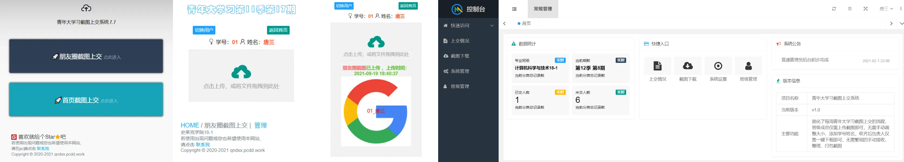

# 青年大学习截图上交系统

## 介绍

1. 简化了青年大学习截图上交的流程
2. 班级成员仅需上传截图即可，无需手动加文字、手动调整截图大小
3. 班级负责人可以一键下载截图压缩包、查看上交情况等

## 示例图

从左到右依次为：主页、上传页面、上传成功界面、后台主页

## 软件架构

后端：

1. JDK 1.8
2. Spring Boot 2.7.18
3. MySQL 8
4. MyBatis、PageHelper
5. API 文档使用 Swagger3 (http://127.0.0.1:8080/swagger-ui/index.html)

前端：Thymeleaf、jQuery、Layui、LAYUI MINI

## 安装教程

1. JDK 1.8（必须，否则无法使用后台）
2. Maven 3.x.x
3. MySQL 8+ & MySQL 图形管理工具（建议）
4. 执行 SQL 脚本
5. 分别在 student 和 clazz 表中导入班级成员信息和班级信息（仅启动可省略这一步）
6. 修改 application-dev.yml 中数据库配置
7. 修改 my.cnf，去掉 ONLY_FULL_GROUP_BY，详见 https://blog.csdn.net/h123hlll/article/details/130386184

## 使用说明

1. 导入班级相关数据，根据 student 表的 role 字段设置管理员和密码
2. 管理员登录后台，设置青年大学习的季数、期数
3. 收齐后下载即可，然后关闭系统（关闭系统后所有成员无法上传）
4. 使用前重置提交（删除往期截图）并开启系统
5. 非管理员进入后台登录页面前需输入口令，默认为 1433（默认写在前端 js 里），可在 uploda.html 页面 386 行左右修改 js
   代码，结合数据库请自行扩展

## 部署

1. 传统部署
   `nohup java -jar qndxx.jar`

2. Docker 部署（推荐）
   Dockerfile 已写好

## 参与贡献

1. Fork 本仓库
2. 新建 feat_xxx 分支
3. 提交代码
4. 新建 Pull Request